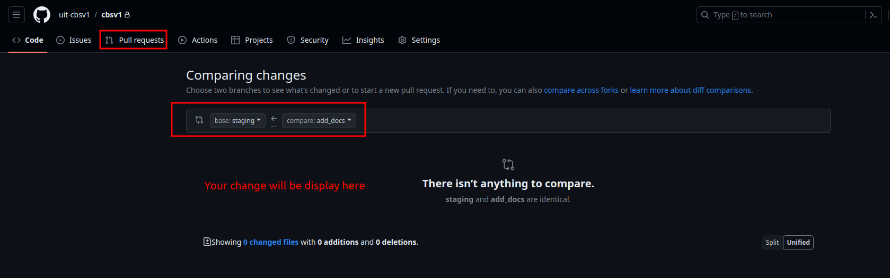
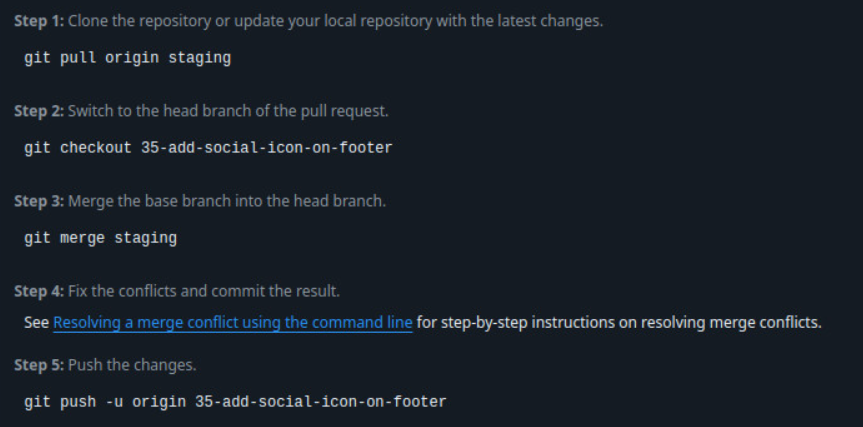

# HSV_Web

Dự án website của Hội sinh viên trường Đại học Công nghệ Thông tin - ĐHQG-HCM, nhằm mục tiêu sau cho các đối tượng là sinh viên UIT:

- Vinh danh tuyên dương những cá nhân có thành tích xuất sắc trong quá trình học tập, các lĩnh vực nghiên cứu khoa học,...
- Tuyên truyền những hình ảnh, câu chuyện đẹp của Sinh viên, Câu lạc bộ, đội, nhóm đến cộng động Sinh viên UIT.
- Đẩy mạnh phong trào và tuyên dương danh hiệu Sinh viên năm tốt qua các năm học,...
- Lưu giữ những văn bản, kế hoạch, công văn quan trọng của Hội Sinh viên qua từng năm.

## Setup local dev

Project gồm 2 branches, bao gồm `main` (production) và `dev` (dev/test).

Để đóng góp vào project, các bạn thực hiện:

1. Cài đặt các công cụ, ngôn ngữ lập trình hỗ trợ như NodeJs (https://nodejs.org/en), git và git bash (https://www.git-scm.com/downloads)
2. Clone the project

- Tùy vào hệ điều hành mà bạn chọn, có thể clone bằng nhiều cách khác nhau

3. Chạy các lệnh sau để setup và build được framework trên máy local

## Contribute 
Để đóng góp vào các quy trình mới, các bạn hãy thực hiện theo hướng dẫn 
### Tạo các file với đúng biểu mẫu
- Trước khi tạo và push project, đảm bảo rằng project đã chạy và build thành công theo hướng dẫn tại phần [Setup](README.md#setup-local-dev)
- Đảm bảo rằng các tài liệu bạn tạo đúng với chuẩn đươc hướng dẫn tại [Hướng dẫn soạn tài liệu](source/huong-dan.md)

### Step by step push new document

1. Check out new branch

```bash
git checkout -b feature/AmazingFeature
```

2. Add new feature

```bash
git add .
```

3. Commit your change

```bash
git commit -m 'feat: Add some AmazingFeature'
```

4. Push your change

```bash
git push --set-upstream origin feature/AmazingFeature
```
5. Go to [pull request](https://github.com/WDS-MHX/HSV_Web/pulls) and create pull request to staging branch. It must be looklike in picture bellow.

### Ví dụ khi bạn muốn tải code để giải quyết issue của bạn

